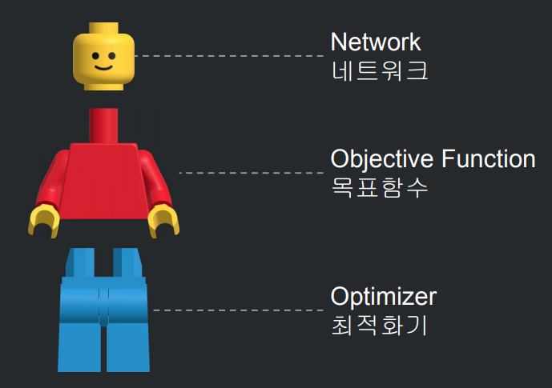

# 문제 정의와 풀이법

## 문제정의

*샘플은 머신러닝 모델에 학습 시키기 위한 최소 단위*  
*샘플을 모은 것을 "데이터셋" *  

### 비지도학습  데이터 -> 샘플

- Data Sample(Features) 가지고만 분류를 하는 것
Feature 의 값이 유사한 것 끼리 분류 / 군집화 한다.
문제 = 데이터 , 정답 = 라벨

### 지도 학습  데이터 + 라벨 -> 샘플

- Data에 Label를 붙여 분류하는 것 (Data에 Label을 붙이는 과정 -> 어노테이션)
각 Data에 Label(이름)을 붙여서 샘플을 생성한다.

### 강화학습

- Data를 가지고 하는 훈련 없이, 보상을 최대하고 피해를 최소하는 액션을 취해 학습하는 것

## 풀이법

Y = 라벨(정답) / X = 데이터(문제)
**실측값: Y= w x X + b**
Y 와 X 값에 각 실제값들을 대입하여 w'. b' 를 계산한다.  
그리고 예측 값 Y' = w' x X + b'으로 하여 주어진 X 값에 대해 예측값 Y'을 계산하는 방식인 것이다.

DeepLearning Model

* 네트워크 = 입력값을 받아서 예측값을 정한다.

활성화 함수: 출력 형태(예측값)를 정한다  
ex) 시그모이드(sigmoid) : 출력을 0.0 ~ 1.0 사이의 실수로 한다  

* 목표함수

네트워크에서 출력된 값을 가지고, 해당 데이터의 실측 값과의 오차를 계산한다.  

* 최적화기

목표함수에서 발생한 오차를 가지고 네트워크를 갱신한다.  

***이러한 과정을 'fit' 학습한다 라고 함***  

### 가중치 w

학습시켜야 할 가중치는 입력값의 개수와 출력값의 개수에 따라 결정된다.  

입력값의 개수 - Xn, 출력값의 개수 - Yn : 학습시킬 가중치의 개수 = Xn x Yn  

이를 코드로 나타내면 Dense(units=Yn, input_dim=Xn, activation='활성화 함수 (sigmoid . relu) )  

### 활성화함수(activation)

출력층에서는 sigmoid / 은닉층 에서는 relu 를 많이 사용한다.

### 목표함수(Objective Function)

이진분류: binary classification -> `binary_crossentropy`

## 질문

* 입력값을 처음 몇개의 feature라 하면 출력값의 개수가 입력값의 개수보다 더 많은 경우는 어떤 경우이고, 구체적인 예시로 무엇이 있을까?   