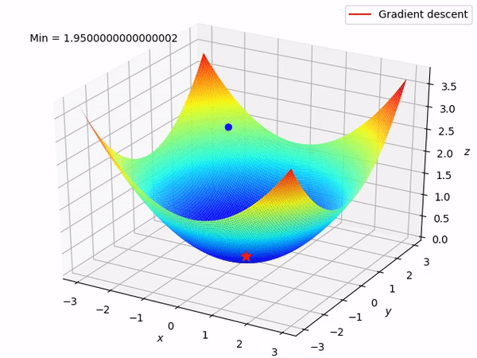

# Linear Regression (선형 회귀)

## 가장 작은 에러를 내는 선형 그래프를 찾아냄

### Error 찾기

#### $Error = h(x) - y$ h(x) = w*x + b
#### $Square Error = (h(x) - y)^2$
#### $Mean Square Error = 1/n * \sum (h(x)-y)^2$

## Find linear equation has Least Mean Square(LMS) Error Using Cost function
### Gradient Decent 개념 : Cost Fucntion = Objective Function(목표함수) 최저로 만들기

#### Gradient Decent to choose \theta in order to minimize cost function h(x) = \theta x
cost function 을 최소화하기 위해 사용되는 알고리즘   
Mean Square Error 함수는 곧 2차함수이다.  
해당 \theta 값에 대하여 경사도가 0이 되는 것을 찾아내는 것이다.  
##### $\theta := \theta - \alpha\frac{\delta}{\delta \theta}  \alpha = Learningt Rate \\ ( Initial Value \theta = 1 , \alpha = 0.1 )$
경사도를 구하기 위해서는 cost function을 미분할 필요가 있다.  
\alpha 의 역할은 W 값의 변화 폭을 의미함   
위 식에서 \theta 값이 0이 될때까지(Converge) 계속적으로 반복한다.

## Convex function

convex function

Convex Function 의 모양을 가지는 cost function 이어야 Gradient Descent 를 적용할 수 있다.  