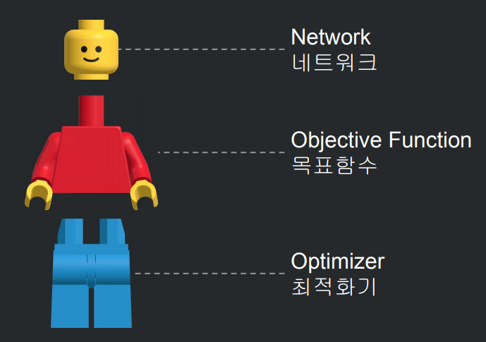

# 문제 정의와 풀이법

## 문제정의

*샘플은 머신러닝 모델에 학습 시키기 위한 최소 단위*  
*샘플을 모은 것을 "데이터셋" *  

### 비지도학습  데이터 -> 샘플

- Data Sample(Features) 가지고만 분류를 하는 것
Feature 의 값이 유사한 것 끼리 분류 / 군집화 한다.
문제 = 데이터 , 정답 = 라벨

### 지도 학습  데이터 + 라벨 -> 샘플

- Data에 Label를 붙여 분류하는 것 (Data에 Label을 붙이는 과정 -> 어노테이션)
각 Data에 Label(이름)을 붙여서 샘플을 생성한다.

### 강화학습

- Data를 가지고 하는 훈련 없이, 보상을 최대하고 피해를 최소하는 액션을 취해 학습하는 것

## 풀이법

Y = 라벨(정답) / X = 데이터(문제)
**실측값: Y= w x X + b**
Y 와 X 값에 각 실제값들을 대입하여 w'. b' 를 계산한다.  
그리고 예측 값 Y' = w' x X + b'으로 하여 주어진 X 값에 대해 예측값을 계산하는 방식인 것이다.

DeepLearning Model

